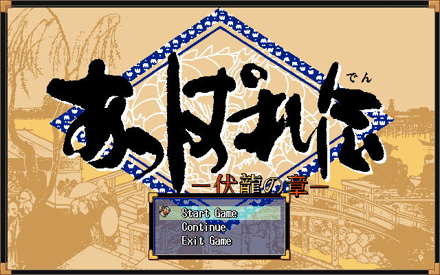

# appareden


Romhacking utilities and notes developed as part of [46 OkuMen](http://46okumen.com/)'s English translation patch for *Appareden - Fukuryuu no Shou* (あっぱれ伝 ー伏龍の章ー) (PC-98), a traditional and colorful JRPG based on Japanese history and myth.

### Draft Reinsertion Progress


| Segment      | %    |  Strings            |
| -------------|-----:|:-------------------:|
| ORTITLE.EXE  | 100%  | (18 / 18)           |
| ORFIELD.EXE  | 100%  | (1326 / 1326)       |
| ORBTL.EXE    | 97%   | (791 / 810)         |
| Dialogue     | 100%  | (5593 / 5592)       |
| Images       | 52%   | (29 / 55)           |
| **Total**    |**99%**|  **(7757 / 7801)**  |

### Requirements
* A working hard-disk dump of *Appareden*
* [romtools](https://github.com/46OkuMen/romtools)
* xlsxwriter
* openpyxl
* Bitstring
* nosetests

### Running Tests
`nosetests`

### Building
Place your dump of `Appareden.hdi` in the subfolder `original`. Then run these scripts to dump the system text, dialogue, and pointers:

```
python sys_dump.py
python msg_dump.py
python find_pointers.py
```

Translate the script, which is dumped into `appareden_sys_dump.xlsx` and `appareden_msg_dump.xlsx`.

Now create a subfolder `patched`, where another copy of `Appareden.hdi` should go. Now run these to reinsert text and images:

```
python reinsert.py
python gem.py
```

Now, `patched/Appareden.hdi` should be playable in English as far as you've translated.

### License
This project is licensed under the Creative Commons A-NC License - see the [LICENSE.md](LICENSE.md) file for details..