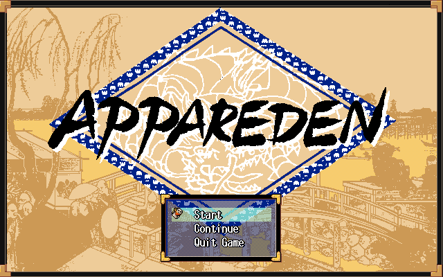

# appareden

Romhacking utilities and notes developed as part of [46 OkuMen](http://46okumen.com/)'s English translation patch for *Appareden - Fukuryuu no Shou* (あっぱれ伝 ー伏龍の章ー) (PC-98), a traditional and colorful JRPG based on Japanese history and myth.

### Draft and Placeholder Reinsertion Progress
| Segment      | %    |  Strings            | 
| -------------|-----:|:-------------------:|
| Title        | 100% |    (18 / 18)        |
| Main         |   7% |    (16 / 202)       |
| Field        | 100% |  (1050 / 1050)      |
| Battle       | 100% |   (708 / 708)       |
| Cat Minigame |   0% |     (0 / 7)         |
| Dialogue     |  15% |  (1979 / 13078)     |
| Images       |   0% |     (0 / 44?)       |
| Total        |  30% |  (3859 / 15193)     |

### How do I use this?
* Wait for a release!
